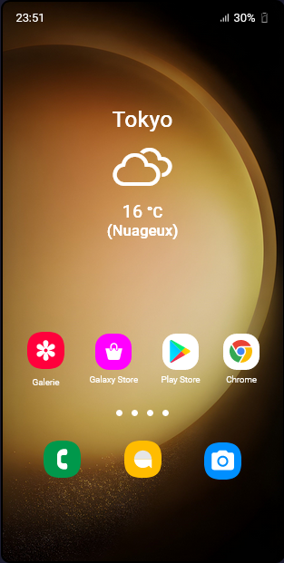
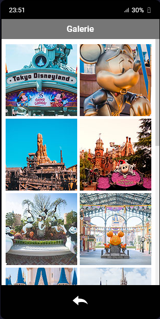
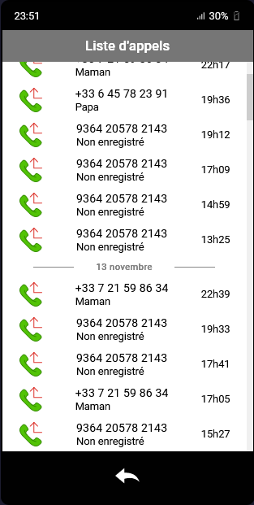
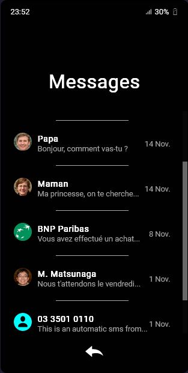

# Citrouilles, Suschis et Marmelade - Application de Simulation de Téléphone

---

## 🇫🇷 Description (Français) 

Cette application permet aux joueurs de consulter le téléphone du personnage non joueur (PNJ) principal du scénario "Citrouilles, Suschis et Marmelade". Elle vise à ajouter une dimension immersive au jeu en offrant aux joueurs un aperçu du contenu du téléphone du PNJ, révélant des indices et des informations pertinentes pour l'avancement du scénario.

## 🇬🇧 Description (English) 

This application allows players to view the phone of the main non-player character (NPC) in the "Citrouilles, Suschis et Marmelade" scenario. It aims to add an immersive dimension to the game by providing players with a glimpse into the NPC's phone content, revealing clues and relevant information for the scenario's progression.

---

## Capture d'écran / Screenshot

   

---

## 🇫🇷 Installation (Français)

1. Clonez ce dépôt vers votre machine locale.
2. Ouvrez le fichier `index.html` dans votre navigateur web préféré.

## 🇬🇧 Installation (English)

1. Clone this repository to your local machine.
2. Open the `index.html` file in your preferred web browser.

---

## 🇫🇷 Utilisation (Français)

1. Lancez l'application en ouvrant le fichier `index.html`.
2. Suivez les instructions à l'écran pour consulter le téléphone du PNJ et découvrir des indices sur le scénario.
3. Lorsqu'on vous demande, utilisez le code PIN suivant pour accéder au téléphone : *25421*.
 
   Ce code correspond à la date d'arrivée du PNJ principal à Tokyo.
Il est utilisé uniquement à des fins de simulation et ne représente pas un code d'accès réel.

## 🇬🇧 Usage (English)

1. Launch the application by opening the `index.html` file.
2. Follow the on-screen instructions to view the NPC's phone and uncover clues about the scenario.
3. When prompted, use the following PIN code to access the phone: *25421*.
 
   This code corresponds to the arrival date of the main NPC in Tokyo.
   It is used solely for simulation purposes and does not represent a real access code.

---

## 🇫🇷 Fonctionnalités à venir

- **Zoom des images :** Permettre l'agrandissement des images en cliquant dans la galerie.
- **Animations dans le header :** Ajouter des animations dans la partie supérieure de l'application.
- **Liens interactifs :** Intégrer des liens interactifs pour le navigateur et d'autres applications.
- **Migration vers SCSS et méthodologie BEM :** Passer du CSS au SCSS en utilisant la méthodologie BEM (Block Element Modifier).
- **Migration vers TypeScript :** Convertir le JavaScript en TypeScript pour une meilleure gestion des types et une meilleure maintenabilité du code.

## 🇬🇧 Planned Features

- **Image Zoom:** Enable image enlargement by clicking in the gallery.
- **Header Animations:** Add animations in the header section of the application.
- **Interactive Links:** Incorporate interactive links for the browser and other applications.
- **Migration to SCSS and BEM methodology:** Transition from CSS to SCSS using the BEM (Block Element Modifier) methodology.
- **Migration to TypeScript:** Convert JavaScript to TypeScript for better type management and code maintainability.

---

## Contribution / Contribution

Les contributions sont les bienvenues ! Veuillez consulter le [guide de contribution](CONTRIBUTING.md) pour obtenir des instructions sur la manière de contribuer au projet.

Contributions are welcome! Please refer to the [contribution guide](CONTRIBUTING.md) for instructions on how to contribute to the project.

---

## Licence / License

Ce projet est sous licence MIT. Consultez le fichier [LICENSE](LICENSE.md) pour plus de détails.

This project is licensed under the MIT License. See the [LICENSE](LICENSE.md) file for details.

---

## Auteur / Author

Créé par Bodeau Christophe.

